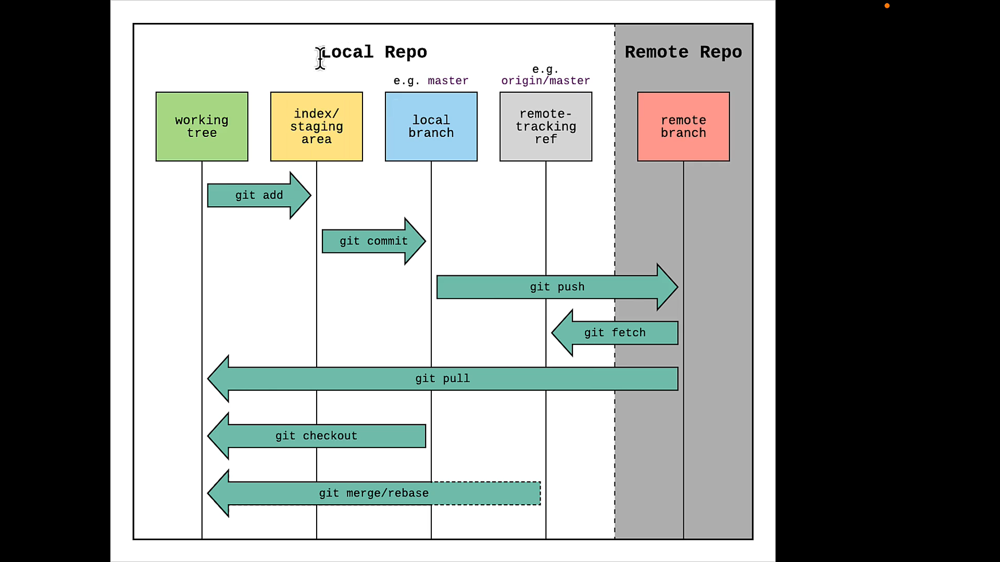

# All about important git commands and markdown sintax 🔮

## Commands : 

1. `git` : all available commands for git

1. `git -v` : get the version of git installed on the computer

1. `git status` : show status of files

1. `git add <fileName>` : move a file from {working directiry (U)} to {staging area(A)} 

1. `git add .` : move all files from {working directory (U)} to {staging area (A)}

1. `git rm --cached <fileName>` : remove a file from {staging area (A)} back to the {working directory (U)}

1. `git commit -m '<commit message>'` : move all files from {staging area (A)} to {commit history}

1. `git log` : log all commits

1. `git log --oneline` : log all commits in shorter form

1. `git log --stat` : log all commits in detail

1. `git log --graph` : log all commits with graphical interface

1. `git log --after='<yy-mm-dd>'` : log commits after a date 

1. `git log --before='<yy-mm-dd>'` : log commits before a date

1. `git log --author='<authorName>'` : show only \<authorName> commits

1. `git commit -am '<commit message>'` : add and commit files with \<commit message> 

1. `git show` : show the details of last commit

1. `git show <commitId>` : show the details of commit with \<commitId>

1. `git config --local alias.<myCommand> '<gitCommand>'` : set a personal cammand for git system locally

1. `git config --global alias.<myCommand> '<gitCommand>'` : set a personal cammand for git system gloabaly

1. `git branch` : show all branches in project

1. `git branch <branchName>` : making a new branch on project

1. `git switch <branchName>` : switching on another branch
 
1. `git switch -c <branchName>` : create and switch to a branch

1. `git branch -d <branchName>` : deleting a branch

1. `git branch -m <branchNewName>` : rename a branch

1. `git merge <branchName>` : merge the active branch with \<branchName>

1. `git diff` : compares differences between {stage} and {WD}

1. `git diff --staged` : compare differences between {last commit} and {stage}

1. `git diff HEAD` : compare differences between {WD} and {last commit}

1. `git diff <commit1Id> <commit2Id>` : compare differences between two commits

1. `git diff <commit1Id> <commit2Id> <fileName>` : only show the changes of a specific file with \<fileName>

1. `git diff <branch1> <branch2>` : compare differences between \<branch1> and \<branch2>

1. `git checkout <commitId>` : detaching HEAD. change the HEAD on a specific commit status

1. `git log --oneline --all` : get all commits after and before HEAD

1. `git switch master` : set the HEAD back to the master branch

1. `git checkout <commitId> <fileName>` : change only the file that mentioned

1. `git checkout HEAD~<N>` : set the HEAD on commit that is \<N> count before HEAD

1. `git checkout HEAD <fileName>` : discard changes on WD for \<fileName> (undo)

1. `git checkout HEAD .` : discard changes for all files (undo all)

1. `git restore <fileName>` : discard (undo) changes on WD for a file

1. `git restore --staged <fileName>` : discard (undo) changes from stage to WD for a file

1. `git restore --source <commitId> <fileName>` : get back a commit 
status in the past for a file

1. `git restore --source HEAD <fileName>` : get back to current commit for a file (the same as `git restore <fileName>`)

1. `git restore --source HEAD~<N> <fileName>` : get back to \<N> commit status in the past for a file 

1. `git clean -h` : help on cleaning a file

1. `git clean -f -d <fileName>` : force deleting a file and whole directory

1. `git reset --soft <commitId>` : delete all commit history after \<commitId> and move the changes after \<commitId> to stage area

1. `git reset [--mixed] <commitId>` : delete all commit history after <commitId> and move the changes after <commitId> to WD

1. `git reset --hard <commitId>` : delete all commit history after \<commitId> and DO NOT save changes

1. `git revert <commitId>` : to cancel the functionality of a commit with \<commitId>

1. `git status -s` : short form of `git status`
<br> <br>

### Connect to GitHub
---
1. `git clone <url>` : for cloning a repository from github on WD

1. `git remote` : show all remotes of a project

1. `git remote add origin <url>` : add main remote for project

1. `git remote add <remoteName> <url>` : add extra remote for project

1. `git remote -v` : get more details about project remotes 

1. `git remote remove <remoteName>` : for deleting a remote from project

1. `git push <remoteName> <branchName>` : push the commits in project to the github 
repository

1. `git push -u origin main` : save the origin remote and main branch name for next push

1. `git push` : same as `git push <remoteName> <branchName>` if `-u` run before (see 8)

1. `git pull <remoteName> <branchName>` : get the last changes from repository

1. `git fetch [<remoteName>] [<branchName>]` : get changes in github on a remote branch named 'origin/main' 

1. `git branch -r` : show all remote branches

1. `git config user.name` : get active userName on local git 

1. `git config user.email` : get active email on local git

1. `git commit -m '#<issueId>'` : this commit automatically resolve and close the issue in github repo with issue an specific issue issueId

1. `git push -u origin <branchName>` : push changes in github on a separated branch from main branch

1. `git remote add upstream <mainRepoURL>` : adding remote for main version of forked repo

## Notes : 
1. ### Simbols in VSCode:
   - U : Untracked
   - A : Added to stage
   - M : Modified
2. ### Command flags : We can use flags with each other eg. `git log --<flag1> --<flag2>`
3. ### Creating a branch : Before creating any branch switch to master first.

4. ### Avoid merge conflict : Please do a single task in a branch and don't make it long to merge

5. ### Best Practice commit messages : [See Website](https://www.conventionalcommits.org/en/v1.0.0/)

6. ### Important commit types :
   - `fix` 
   - `feat`  
   - `build`
   - `chore`
   - `ci`
   - `docs` 
   - `style`
   - `refactor`
   - `perf` 
   - `test`

7. ### `/dev/null` in deff command means file didn't created yet

8. ### Gitignore : files named in `.gitignore` file will not be tracking by git
   - gitignore generator : [See Website](https://www.toptal.com/developers/gitignore)

9. ### `git pull` = `git fetch` + `git merge`

10. ### How to work with `git fetch`:
    1. create and switch to new branch by this cammand : `git switch -c <brachName> origin/main`
    2. observe new branch and checkout changes and change it for yourself if needed 
    3. merge the new branch with main branch

11. ### Pull Request : For creating a pull request on project first do `git push -u origin <branchName>` then go to github and pull request section

12. ### Fork : For developing a feature for a repo use fork to make a copy of repo on your account

13. ### Fork conflict : For being updated when you are forking a repo and work on it add a upstream remote for pulling last updates (also can use fork sync in github)

<br> <br>

# Markdown templates 👇 : 
# This is a title h1
## This is a title h2
### This is a title h3
#### This is a title h4
##### This is a title h5
###### This is a title h6 

This is a normal text

<p>This is a paragraph</p>

horizontal line 1
--- 

horizontal line 2
___ 

horizontal line 3
***

Ordered List: 

1. html
2. css
3. javascript
4. git 
5. react js
6. tailwind css
7. node js
1. foo
1. bazz

Unordered List: 

- item 1 
+ item 2
* item 3
- item 4
  - item4a
    - item4aa
  - item4b
  - irem4c

`Highlighted Text`

    // Some comments
    line 1 of code
    line 2 of code
    line 3 of code

```
simple code space
```

```js
// JavaScript code space
console.log('Test Message');
const func = function(){
    return true;
};
```

```diff
+ const x = 10;
- const y = 20;
```

## Typography
_Italic Text_ <br>
*Italic Text 2* <br> 
__Bold Text__ <br>
**Bold Text 2** <br>

## Blockquotes
> Blockquotes can also be nested...
>> ...by using additional greater-than signs right next to each other...
>>> ...or with spaces between arrows.

## Links

[link text](http://dev.nodeca.com)

[link with title](http://nodeca.github.io/pica/demo/ "title text!")


## Tables

| Option | Description |
| ------ | ----------- |
| data   | path to data files to supply the data that will be passed into templates. |
| engine | engine to be used for processing templates. Handlebars is the default. |
| ext    | extension to be used for dest files. |

Right aligned columns

| Option | Description |
| ------:| -----------:|
| data   | path to data files to supply the data that will be passed into templates. |
| engine | engine to be used for processing templates. Handlebars is the default. |
| ext    | extension to be used for dest files. |


::: warning
*here be dragons*
:::

## Image


## Badges
[See More Badges](https://github.com/alexandresanlim/Badges4-README.md-Profile)


